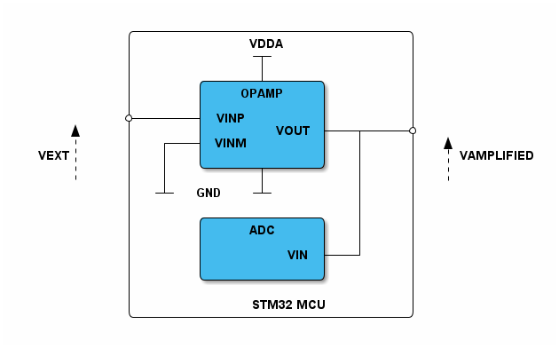

# __Example: *ll_opamp_programmable_gain_amplifier*__

**Example version:** 2.0.0

How to configure, with the LL API, an embedded amplifier (OPAMP) in programmable gain amplifier mode.
The OPAMP applies a configurable gain to the analog input signal and sends it through the output pin which is connected internally to ADC peripheral to convert the amplified analog signal to digital.

## __1. Detailed scenario__

__Initialization phase__: At main program start, the `mx_system_init()` function is called. It initializes the peripherals, nonvolatile memory (such as flash memory, NVM, or external memories), MPU regions (if applicable), the system clock, and the SysTick.

The application executes the following __example steps__:

__Step 1__: configures the OPAMP peripheral.

__Step 2__: configures the ADC peripheral.

__Step 3__: start the ADC peripheral conversion of amplified signal from OPAMP output.

__Step 4__: retrieves the output voltage value.

__End of example__: This example is repeated endlessly (step 3 and step 4 are executed in a loop).
You can verify that the example runs properly via the status LED and the `ExecStatus` variable.
You can also check the amplified voltage value converted to mV with a debugger (check `AmplifiedVoltageValue`).

## __2. Example configuration__

This example demonstrates the **OPAMP** and **ADC** peripherals configured as indicated below:

__OPAMP__ is configured in programmable gain amplifier mode with a gain of 4.
Its low-power mode is disabled and the device speed is set to high.

__ADC__ is configured in single channel conversion from regular group with a software trigger, and started in interrupt mode.

## __3. Hardware environment and setup__

### __3.1. Generic Setup__

This section describes the hardware setup principles that apply to any board.
To use this example, apply an external analogic signal on the input pin of the OPAMP (EXTERNAL VOLTAGE).
You can measure the amplified signal on the output pin with an oscilloscope (AMPLIFIED VOLTAGE).

<!--
@startuml
@startditaa{doc/example_ll_opamp_programmable_gain_amplifier-setup.png}

                    /-------------------------------\
                    |             VDDA              |
                    |             -+-               |
                    |              |                |
                    |       /------+------\         |
                    |       |    OPAMP    |         |
                    |       |             |         |
                 ---*-------+ VINP        |         |
                 ^  |       |        VOUT +---+-----*---
                 |  |   +---+ VINM        |   |     |  ^
 EXTERNAL VOLTAGE:  |   |   |        c4BE |   |     |  :AMPLIFIED VOLTAGE
                 |  |   |   \------+------/   |     |  |
                 |  |   |          |          |     |  |
                    |  -+-  GND   -+-         |     |
                    |                         |     |
                    |       /------+------\   |     |
                    |       |     ADC     |   |     |
                    |       |             |   |     |
                    |       |         VIN +---+     |
                    |       | c4BE        |         |
                    |       \-------------/         |
                    |                               |
                    |             STM32 MCU         |
                    \-------------------------------/
@endditaa
@enduml
-->

### __3.2. Specific board setups__

This section describes the exact hardware configurations of your project.

  
On STM32C5 series.

  

    
On board NUCLEO-C542RC.

  |  MCU pin  |  Signal name  |  User Label  |
  |:---------:|:-------------:|:------------:|
  |    PH0    |  RCC_OSC_IN   |    OSC_IN    |
  |    PH1    |  RCC_OSC_OUT  |   OSC_OUT    |
  |    PA1    | OPAMP1_VINP0  |     PA1      |
  |    PA6    |  OPAMP1_VOUT  |     PA6      |

  |  PA5  |  GPIO  |  MX_STATUS_LED  |
  |-------|--------|-----------------|

  

## __4. Troubleshooting__

Find below the points of attention for this specific example.

__Calibration__: This example uses factory trimming values.
However, calibration can be performed to adjust the values to your working environment.

__Gain & filtering__: The gain of the OPAMP can only be modified using the built-in values.
However, for a custom gain, you can use a standalone configuration with external resistors.
Additionally, adding capacitors can provide filtering features to the circuit.

__Voltage Range__: The OPAMP delivers a voltage between 0V and VDDA (not always 3.3 V).
Be careful when using 1.8 V boards.

__Comparator Use-Case__: Although an OPAMP can be used as a standalone comparator, it is recommended to use a COMP IP instead, as it offers more features.

__Error handling__: In LL examples, error handling is controlled by the USE_LL_APP_ERROR constant in the application files to reduce code footprint. This compilation flag is disabled by default. If the example does not behave as expected, enable error handling for debugging by setting USE_LL_APP_ERROR to 1 in ll_example.h.

__Timeout management__: Polling flag instructions can cause the example to enter an infinite loop. To prevent this, a timeout mechanism is implemented. When the timeout is reached, the program exits the loop and reports the error at the application level. This mechanism is controlled by the USE_LL_APP_TIMEOUT compilation flag, which is disabled by default to reduce code footprint. If the example execution appears to be stuck in an infinite loop, enable this mechanism for debugging by setting USE_LL_APP_TIMEOUT to 1 in ll_example.h.

## __5. See Also__

This [application note](https://www.st.com/resource/en/application_note/an5306-operational-amplifier-opamp-usage-in-stm32g4-series-stmicroelectronics.pdf)
explains further the OPAMP application for analog circuits.

You can also refer to these other examples:

- hal_opamp_calibration: demonstrates the calibration of the OPAMP.
- hal_opamp_interconnect: integrates this peripheral with DAC and ADC.

The documentation of the drivers of the relevant STM32 series contains more detailed information.

For instance for the STM32C5 series: [HAL documentation](https://dev.st.com/stm32cube-docs/stm32c5xx-hal-drivers/latest/en/index.html).

More information about the STM32 ecosystem can be found in the [STM32 MCU Developer Zone](https://www.st.com/content/st_com/en/stm32-mcu-developer-zone/embedded-software.html).

## __6. License__

Copyright (c) 2026 STMicroelectronics.

This software is licensed under terms that can be found in the LICENSE file in the root directory
of this software component.
If no LICENSE file comes with this software, it is provided AS-IS.
