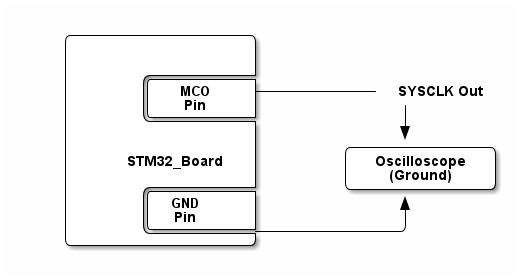

# __Example: *ll_rcc_clock_switch_max_default*__

**Example version:** 2.0.0

How to configure the system clock (SYSCLK) and update clock source in run mode using RCC LL APIs.

## __1. Detailed scenario__

The system clock (SYSCLK) is the main clock source for the microcontroller. This example shows how to switch between max clock frequency, and default clock, while routing the frequency to MCO pin.

__Initialization phase__: At main program start, the `mx_system_init()` function is called. It initializes the peripherals, nonvolatile memory (such as flash memory, NVM, or external memories), MPU regions (if applicable), the system clock, and the SysTick.

The application executes the following __example steps__:

__Step 1__: At startup, SYSCLK is configured to the maximum clock source frequency. The SYSCLK signal is provided on the MCO pin and is divided by the MCO prescaler (in this example, MCO1 outputs SYSCLK/10).

__Step 2__: Switches the clock speed from Max to Default then waits for 1s.

__Step 3__: Switches the clock speed from Default to Max.

__End of example__: After step 3, the example is finished and signal remains generated through MCO pin. You can verify that the example runs properly via the status LED and the `ExecStatus` variable.

## __2. Example configuration__

This example demonstrates the following peripheral:

__RCC__:

Use different clock source to generate the SYSCLK.

- Default is the startup clock without any clock reconfiguration

- Max is the fastest speed available supported by the MCU while configuring high speed external clock sources and PLL using CubeMX

| Board            | Default SYSCLK | Max SYSCLK | MCO1 Prescaler | Default MCO1 | Max MCO1 |
| :--------------- | :------------: | :--------: | :------------: | :----------: | :------: |
| NUCLEO-C542RC    | 48 MHz         | 144 MHz    | /10             | 4.8 MHz      | 14.4 MHz |
| NUCLEO-C562RE    | 48 MHz         | 144 MHz    | /10             | 4.8 MHz      | 14.4 MHz |
| NUCLEO-C5A3ZG    | 48 MHz         | 144 MHz    | /10             | 4.8 MHz      | 14.4 MHz |

## __3. Hardware environment and setup__

### __3.1. Generic Setup__

No specific hardware setup is needed for this example.
Nevertheless, an oscilloscope may also be used to monitor the system clock value on the MCO pin.

<!--
@startditaa doc/example_ll_rcc_clock_switch_max_default.png
    /------------------\
    |                  |
    |                  |
    |       /----------+
    |       |   MCO    +------------ SYSCLK Out
    |       |   Pin    |              |
    |       \----------+              |
    |                  |              v
    |                  |        /--------------\
    |     STM32_Board  |        | Oscilloscope |
    |                  |        |   (Ground)   |
    |       /----------+        \--------------/
    |       |  GND     |              ^
    |       |  Pin     |              |
    |       \----------+--------------/
    \------------------/
@endditaa
-->

### __3.2. Specific board setups__

This section describes the exact hardware configurations of your project.

On STM32C5 series.

  
On board NUCLEO-C542RC.

  | Board connector   | MCU pin | Signal name | ARDUINO   connector pin |User Label|
  | :---:             | :---:   | :---:       | :---:                      | :---:    |
  | CN9-8             | PA8     | MCO1        | D7                         | PA8      |
  | CN5-6             | PA5     | LED         | D13                        | PA5      |

  
On board NUCLEO-C562RE.

  | Board connector   | MCU pin | Signal name | ARDUINO   connector pin |User Label|
  | :---:             | :---:   | :---:       | :---:                      | :---:    |
  | CN9-8             | PA8     | MCO1        | D7                         | PA8      |
  | CN5-6             | PA5     | LED         | D13                        | PA5      |

  
On board NUCLEO-C5A3ZG.

  | Board connector   | MCU pin | Signal name | ARDUINO   connector pin |User Label|
  | :---:             | :---:   | :---:       | :---:                      | :---:    |
  | CN9-8             | PA8     | MCO1        | D7                         | PA8      |
  | CN5-6             | PA5     | LED         | D13                        | PA5      |

## __4. Troubleshooting__

Find below the points of attention for this specific example.

__Error handling__: In LL examples, error handling is controlled by the USE_LL_APP_ERROR constant in the application files to reduce code footprint. This compilation flag is disabled by default. If the example does not behave as expected, enable error handling for debugging by setting USE_LL_APP_ERROR to 1 in ll_example.h.

__Timeout management__: Polling flag instructions can cause the example to enter an infinite loop. To prevent this, a timeout mechanism is implemented. When the timeout is reached, the program exits the loop and reports the error at the application level. This mechanism is controlled by the USE_LL_APP_TIMEOUT compilation flag, which is disabled by default to reduce code footprint. If the example execution appears to be stuck in an infinite loop, enable this mechanism for debugging by setting USE_LL_APP_TIMEOUT to 1 in ll_example.h.

## __5. See Also__

You can find more information on the reference manual of your chosen MCU, in the *reset and clock control (RCC)* section.

For instance for the STM32C5 series: [HAL documentation](https://dev.st.com/stm32cube-docs/stm32c5xx-hal-drivers/latest/en/index.html).

More information about the STM32 ecosystem can be found in the [STM32 MCU Developer Zone](https://www.st.com/content/st_com/en/stm32-mcu-developer-zone/embedded-software.html).

## __6. License__

Copyright (c) 2026 STMicroelectronics.

This software is licensed under terms that can be found in the LICENSE file in the root directory
of this software component.
If no LICENSE file comes with this software, it is provided AS-IS.
