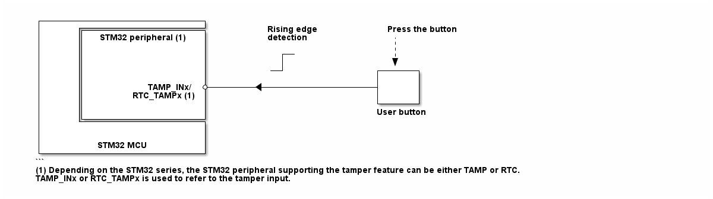

# __Example: *ll_tamp_erase_backup_registers*__

**Example version:** 2.0.0

[](https://dev.st.com/stm32cube-docs/examples/arch-v1/en/index.html "An offline version is also available in the STM32Cube firmware package.")

How to automatically erase the backup 0 register when an external tamper event occurs, using the TAMP LL APIs.


## __1. Detailed scenario__

__Initialization phase__: At main program start, the `mx_system_init()` function is called. It initializes the peripherals, nonvolatile memory (such as flash memory, NVM, or external memories), MPU regions (if applicable), the system clock, and the SysTick.

The application executes the following __example steps__:

__Step 1__: initializes the peripheral and configures the tamper input.
 - Disables the backup domain write protection to access to the backup registers.
 - Configures the tamper event activation on rising-edge.

__Step 2__: sets the backup 0 register to the value 0xAAAAAAAA and checks the written data.

__Step 3__: starts the tamper and enables the interruption for the selected tamper input.

__Step 4__: waits for the tamper detection interrupt. It is generated when the user button is pressed.

__Step 5__: checks that the hardware automatically clears the backup 0 register on tamper detection.

__Step 6__: deinitializes the peripheral.

__End of example__: After step 6, the example is completed.


## __2. Example configuration__

[](https://dev.st.com/stm32cube-docs/examples/arch-v1/en/configure/config_toc.html "An offline version is also available in the STM32Cube firmware package.")

This example demonstrates the following peripherals:

__TAMP__:

The tamper detection event is activated on the rising-edge.

When the edge detection is selected, the internal pull-up resistor on the tamper input is deactivated.

By default, the backup registers are automatically erased on tamper detection.

The tamper is configured in interrupt mode.

The tamper input pin is connected to the user button to trigger an external tamper event.

The TAMP kernel clock source is the LSE oscillator.

__RCC__:

The backup domain write protection is disabled to access to the TAMP domain and backup registers.


## __3. Hardware environment and setup__

### __3.1. Generic Setup__

This section describes the hardware setup principles that apply to any board.

<!--
@startuml
@startditaa{doc/example_ll_tamp_erase_backup_registers.png}
    +---------------------------+
    |      +--------------------+          Rising edge       Press the button
    |      |STM32 peripheral (1)|          detection            |
    |      |                    |                               :
    |      |                    |            +--                |
    |      |                    |            |                  v
    |      |                    |          --+               +------+
    |      |                    |                            +      +
    |      |          TAMP_INx/ *--------<-------------------+      +
    |      |       RTC_TAMPx (1)|                            +      +
    |      |                    |                            +------+
    |      |                    |                           User button
    |      +--------------------+
    |                           |
    |                           |
    |         STM32 MCU         |
    +---------------------------+
    ```
    (1) Depending on the STM32 series, the STM32 peripheral supporting the tamper feature can be either TAMP or RTC.
    TAMP_INx or RTC_TAMPx is used to refer to the tamper input.

@endditaa
@enduml
-->



### __3.2. Specific board setups__

This section describes the exact hardware configurations of your project.

<details>
  <summary>On STM32C5 series.</summary>
  <details>
    <summary>On board NUCLEO-C542RC.</summary>

  |  MCU pin  |  Signal name  |  User Label   |
  |:---------:|:-------------:|:-------------:|
  |    PH0    |  RCC_OSC_IN   |    OSC_IN     |
  |    PH1    |  RCC_OSC_OUT  |    OSC_OUT    |
  |   PC14    | RCC_OSC32_IN  |   OSC32_IN    |
  |   PC15    | RCC_OSC32_OUT |   OSC32_OUT   |
  |   PC13    |   TAMP_IN1    |     PC13      |
  |    PA5    |     GPIO      | MX_STATUS_LED |

  </details>

  <details>
    <summary>On board NUCLEO-C562RE.</summary>

  |  MCU pin  |  Signal name  |  User Label   |
  |:---------:|:-------------:|:-------------:|
  |    PH0    |  RCC_OSC_IN   |    OSC_IN     |
  |    PH1    |  RCC_OSC_OUT  |    OSC_OUT    |
  |   PC14    | RCC_OSC32_IN  |   OSC32_IN    |
  |   PC15    | RCC_OSC32_OUT |   OSC32_OUT   |
  |   PC13    |   TAMP_IN1    |     PC13      |
  |    PA5    |     GPIO      | MX_STATUS_LED |

  </details>

  <details>
    <summary>On board NUCLEO-C5A3ZG.</summary>

  |  MCU pin  |  Signal name  |   User Label   |
  |:---------:|:-------------:|:--------------:|
  |    PH0    |  RCC_OSC_IN   |   PH0_OSC_IN   |
  |    PH1    |  RCC_OSC_OUT  |  PH1_OSC_OUT   |
  |   PC14    | RCC_OSC32_IN  | PC14_OSC32_IN  |
  |   PC15    | RCC_OSC32_OUT | PC15_OSC32_OUT |
  |   PC13    |   TAMP_IN1    |      PC13      |
  |    PA5    |     GPIO      | MX_STATUS_LED  |

  </details>
</details>


## __4. Troubleshooting__

[](https://dev.st.com/stm32cube-docs/examples/arch-v1/en/debug/debug_toc.html "An offline version is also available in the STM32Cube firmware package.")


Here are the points of attention for this specific example:

__Tamper kernel clock__: The TAMP kernel clock is usually the LSE although it is possible to select other clock sources in the RCC. Refer to the RCC chapter in the Reference Manual of your STM32 device for more details.

__Backup domain Power__: The TAMP features and backup registers are part of the backup domain that remains powered-on by VBAT when the VDD power is switched off.

__Reset behavior__: The backup registers are not reset by system reset.
After reset, the backup domains are protected against possible unwanted write accesses. So, you must enable access to the TAMP domain and TAMP registers to configure the TAMP.

__STM32 architecture__: For some STM32 series like U5, H5 and others TAMP is not part of the RTC IP.
It is considered as an independent peripheral with separate features.

__Configuration terms__: The TAMP features are not the same for all STM32 series. Therefore, some terms are not found in all reference manuals. The term "passive tamper" refers to the detection method, and "confirmed mode" refers to the action taken upon detection.

- "passive tamper" means a tamper event detected either on edge or on level,
- "confirmed mode" implies an automatic erasure of backup registers on tamper detection.

When these terms are defined, the configuration we demonstrate is: TAMP in confirmed mode with passive tamper.


## __5. See Also__

[](https://dev.st.com/stm32cube-docs/examples/arch-v1/en/more/more_toc.html "An offline version is also available in the STM32Cube firmware package.")

The AN4759 application note related to the TAMP features is also available [here.](https://www.st.com/resource/en/application_note/an4759-introduction-to-using-the-hardware-realtime-clock-rtc-and-the-tamper-management-unit-tamp-with-stm32-mcus-stmicroelectronics.pdf)

More information about the STM32Cube Drivers can be found in the drivers' user manual of the STM32 series you are using.

For instance for the STM32C5 series: [HAL documentation](https://dev.st.com/stm32cube-docs/stm32c5xx-hal-drivers/latest/en/index.html).

More information about the STM32 ecosystem can be found in the [STM32 MCU Developer Zone](https://www.st.com/content/st_com/en/stm32-mcu-developer-zone/embedded-software.html).


## __6. License__

Copyright (c) 2026 STMicroelectronics.

This software is licensed under terms that can be found in the LICENSE file in the root directory
of this software component.
If no LICENSE file comes with this software, it is provided AS-IS.
