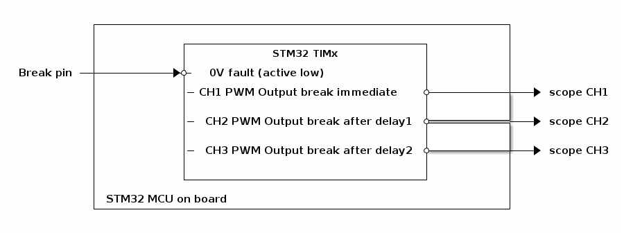

# __Example: *ll_tim_delayed_break*__

**Example version:** 2.0.0

How to configure the TIM peripheral to generate 3 PWM signals with, respectively, IMMEDIATE, DELAY1, DELAY2 break modes for the 3 channels.

## __1. Detailed scenario__

This scenario demonstrates how to configure the TIM peripheral to generate 3 PWM signals with IMMEDIATE, DELAY1, DELAY2 break modes for each channel. A delayed break is a safety feature found in advanced-control timers that allows for a controller, sequenced shutdown of PWM outputs after a break event occurs.

__Initialization phase__: At main program start, the `mx_system_init()` function is called. It initializes the peripherals, nonvolatile memory (such as flash memory, NVM, or external memories), MPU regions (if applicable), the system clock, and the SysTick.

The application executes the following __example steps__:

__Step 1__: Initializes the timer's input clock, counter clock, output clock. Sets the output channels duty cycles, the break pin and the GPIO pins.

__Step 2__: Starts the timer PWM generation for the three channels.

__End of example__: If no error occurs, the PWM signals are generated indefinitely until a break event is detected on the break input pin.

## __2. Example configuration__

## __2.1. Timer and PWM Configuration__

The *TIM* is configured as follows:

- The timer channels (say '1', '2' and '3') are configured as PWM generator in up counting PWM mode 1.
- The timer prescaler is configured to set the timer counter clock to 1 MHz.
- The PWM duty cycle is configured at 90% for the three channels.
- The PWM frequency is configured at 10 kHz.
- The break feature uses Break Input 1 (BKIN) with an active low fault level.
- The break input source is the dedicated TIM1 GPIO break path and is enabled as non-inverted.
- Channel break modes are configured as: CH1 immediate, CH2 delay1, CH3 delay2.
- The programmed delayed-break values are: delay1 = 60 and delay2 = 120

Note that the timer configuration depends on the timer peripheral input clock, which is derived from the system clock tree.
So, it is required to define the system clock configuration and to determine the timer input clock before defining the timer configuration.

#### __2.2. PWM frequency and duty cycles configuration:__

The timer's autoreload register (ARR) defines the PWM period in number of timer counter clock (tim_cnt_ck) cycles.
The ARR value is chosen as indicated below:

    PWM period = tim_cnt_ck period * (ARR + 1)
    PWM frequency = tim_cnt_ck frequency / (ARR + 1)
    ARR = (tim_cnt_ck frequency / PWM frequency) - 1

The timer's capture/compare channel is used to define the PWM duty cycle.
It is configured by setting the timer's Capture Compare Register (CCR).

The CCR defines the duration of the output active state in number of tim_cnt_ck cycles, and its value should be strictly lower than (ARR + 1).

The PWM duty cycle, expressed as a percentage, is calculated as the ratio of the output active state to the PWM period, multiplied by 100:

    duty_cycle_percent = (CCR / (ARR + 1)) * 100
    CCR = (duty_cyle_percent * (ARR + 1)) / 100

  
Numerical calculations

  To set a PWM output frequency to 10kHz with a 1MHz timer counter clock:

    ARR = (1 MHz / 10 kHz) - 1
    ARR = (1000000 / 10000) - 1
    ARR = 99

   To set the channels PWM duty cycle to 90%:

    CCR = (90 / 100) * 100
    CCR = 90

## __2.3. Delay Calculation for Staggered Shutdown__

The shutdown delays are calculated using the sampling clock period (Tdts), which is:

  Tdts = 1 / f_tim_ker_ck

- Channel 1 (Immediate Break): Responds as quickly as possible to the break event.

Timing Note: This response is subject to hardware propagation time, which can be be between 50 and 80 ns.

- Channel 2 (Delay 1): Uses a linear delay configuration.

Tdelay1 = Tdts * delayval1

- Channel 3 (Delay 2): Uses a scaled delay configuration for longer durations.

Tdelay2 = Tdts * delayval2

**_Note on Synchronization:_** For both delayed channels, the internal delay counter only begins after a hardware synchronization period of 2 clock periods.

### __2.3. GPIO configuration__

Four pins must be configured, three for each PWM signal and one for the break: [see the specific boards setups](#32-specific-board-setups)

The GPIO pins are configured as below:

For the PWM channels:

- Alternate function as a timer output channel of its respective timer instance.
- Push-pull mode with no pull-up or pull-down resistors activated.

For the break pin:

- Alternate function as a timer.
- open-drain mode with pull-up resistors activated.

## __3. Hardware environment and setup__

### __3.1. Generic Setup__

This section describes the hardware setup principles that apply to any board.

<!--
@startuml
@startditaa{doc/hardware_setup_delayed_break.png}
                  +-----------------------------------------------------------+
                  |                                                           |
                  |            +----------------------------------+           |
                  |            |            STM32 TIMx            |           |
                  |            |                                  |           |
       Break pin--+----------->*-0V fault (active low)            |           |
                  |            |                                  |           |
                  |            |-CH1 PWM Output break immediate   *-----------+---> scope CH1
                  |            |                                  |           |
                  |            |                                  |           |
                  |            |-CH2 PWM Output break after delay1*-----------+---> scope CH2
                  |            |                                  |           |
                  |            |                                  |           |
                  |            |-CH3 PWM Output break after delay2*-----------+---> scope CH3
                  |            |                                  |           |
                  |            |                                  |           |
                  |            +----------------------------------+           |
                  |                                                           |
                  | STM32 MCU on board                                        |
                  +-----------------------------------------------------------+
@endditaa
@enduml
-->

The PWM signals generated by the timer channels can be displayed by connecting an oscilloscope to the corresponding board connectors.

To generate the break signal, connect TIM_BKIN pin to GND. 
Once the TIM_BKIN is disconnected from GND, the PWM is automatically re-enabled.

### __3.2. Specific board setups__

  
On STM32C5 series.

  

    
Common configuration.

  Timer's counter clock configuration with prescalers and APB prescalers set to 1:

  - The AHB clock (HCLK) and system core clock are set to system clock (SYSCLK).
  - The timer's internal input clock (tim_ker_ck) is set to its respective APB clock (PCLK).

      tim_ker_ck = PCLK = HCLK = SYSCLK (system clock)

      So, tim_ker_ck = HCLK in Hz

  To obtain the timer's counter clock frequency (tim_cnt_ck), the timer prescaler register (TIM_PSC) is computed as follows:

      TIM_PSC = (HCLK / tim_cnt_ck ) - 1

<!--
@startuml
@startditaa{doc/stm32c5_peripherals_clocks.png}
  +---------+
  | clock   |
  | source  |
  | control |
  +---+-----+
  |
  ++-\
--+  |
  |  |
  |  |
--+  |           +---------------+        +--------------+
  |  |  SYSCLCK  |  AHB          |  HCLK  |  APBx        |  PCLKx
  |  +-----------+  PRESC        +----+---+  PRESC       +--------------------------------
--+  |           |  / 1,2,...512 |    |   | / 1,2,4,8,16 |          To APBx peripherals
  |  |           +---------------+    |   +--------------+
  |  |                                |
--+  |                                +---------------------------------------------------
  |  |                                                                          To TIMx
  +--/
@endditaa
@enduml
-->
  

In this configuration:

- The tim_ker_ck is set to 144MHz.
- The timer counter clock is set to 1 MHz.

To obtain a timer counter clock at 1MHz with the APB prescaler set to 1 and the HCLK set to 144MHz, the timer prescaler must be:

      timer_prescaler = (144 MHz / 1 MHz) - 1 = 143

  Tdts = 1 / f_tim_ker_ck
       = 1 / 144000000 = 6.94

  Tdelay1 = 60 * 6.94 ns = 416.4 ns
  Tdelay2 = 120 * 6.94 ns = 832.8 ns

  

  

    
On board NUCLEO-C542RC.

  |  MCU pin  |  Signal name  |  User Label   |
  |:---------:|:-------------:|:-------------:|
  |    PA5    |     GPIO      | MX_STATUS_LED |
  |    PH0    |  RCC_OSC_IN   |    OSC_IN     |
  |    PH1    |  RCC_OSC_OUT  |    OSC_OUT    |
  |    PA8    |   TIM1_CH1    |      PA8      |
  |    PA9    |   TIM1_CH2    |      PA9      |
  |    PA10   |   TIM1_CH3    |      PA10     |
  |    PA6    |   TIM1_BKIN   |      PA6      |

  The selected timer is TIM1, with:

  - TIM1_CH1 for channel 1X
  - TIM1_CH2 for channel 2X
  - TIM1_CH3 for channel 3X

  

  

    
On board NUCLEO-C562RE.

  |  MCU pin  |  Signal name  |  User Label   |
  |:---------:|:-------------:|:-------------:|
  |    PA5    |     GPIO      | MX_STATUS_LED |
  |    PH0    |  RCC_OSC_IN   |    OSC_IN     |
  |    PH1    |  RCC_OSC_OUT  |    OSC_OUT    |
  |    PA8    |   TIM1_CH1    |      PA8      |
  |    PA9    |   TIM1_CH2    |      PA9      |
  |    PA10   |   TIM1_CH3    |      PA10     |
  |    PA6    |   TIM1_BKIN   |      PA6      |

  The selected timer is TIM1, with:

  - TIM1_CH1 for channel 1X
  - TIM1_CH2 for channel 2X
  - TIM1_CH3 for channel 3X

  

  

    
On board NUCLEO-C5A3ZG.

  |  MCU pin  |  Signal name  |  User Label   |
  |:---------:|:-------------:|:-------------:|
  |    PA5    |     GPIO      | MX_STATUS_LED |
  |    PH0    |  RCC_OSC_IN   |    OSC_IN     |
  |    PH1    |  RCC_OSC_OUT  |    OSC_OUT    |
  |    PA8    |   TIM1_CH1    |      PA8      |
  |    PA9    |   TIM1_CH2    |      PA9      |
  |    PA10   |   TIM1_CH3    |      PA10     |
  |    PA6    |   TIM1_BKIN   |      PA6      |

  The selected timer is TIM1, with:

  - TIM1_CH1 for channel 1X
  - TIM1_CH2 for channel 2X
  - TIM1_CH3 for channel 3X

  

## __4. Troubleshooting__

Here are the points of attention for this specific example:

__System clock__: The timer clock depends on the system clock configuration. Changing the CPU clock or the peripheral bus' clock affects the PWM frequency and duty cycle.

## __5. See Also__

You can also refer to this other example:

- hal_tim_delayed_break: same example in hal.

This [General-purpose timer cookbook for STM32 microcontrollers (ref. AN4776)](https://www.st.com/content/ccc/resource/technical/document/application_note/group0/91/01/84/3f/7c/67/41/3f/DM00236305/files/DM00236305.pdf/jcr:content/translations/en.DM00236305.pdf) provides a simple and clear description of the basic features and operating modes of the STM32 general-purpose timer peripherals.

This [STM32 cross-series timer overview (ref. AN4013)](https://www.st.com/content/ccc/resource/technical/document/application_note/54/0f/67/eb/47/34/45/40/DM00042534.pdf/files/DM00042534.pdf/jcr:content/translations/en.DM00042534.pdf) presents an overview of the timer peripherals for the STM32 product series.

More information about the STM32Cube Drivers can be found in the drivers' user manual of the STM32 series you are using.

For instance for the STM32C5 series: [HAL documentation](https://dev.st.com/stm32cube-docs/stm32c5xx-hal-drivers/latest/en/index.html).

More information about the STM32 ecosystem can be found in the [STM32 MCU Developer Zone](https://www.st.com/content/st_com/en/stm32-mcu-developer-zone/embedded-software.html).

## __6. License__

Copyright (c) 2026 STMicroelectronics.

This software is licensed under terms that can be found in the LICENSE file in the root directory
of this software component.
If no LICENSE file comes with this software, it is provided AS-IS.
