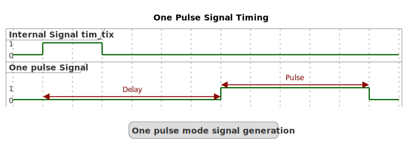

# __Example: *ll_tim_one_pulse*__

**Example version:** 2.0.0

How to configure TIM peripheral to generate a single pulse when a rising edge of an external signal is received on the dedicated TIMER input pin with LL API.

## __1. Detailed scenario__

__Initialization phase__: At main program start, the `mx_system_init()` function is called. It initializes the peripherals, nonvolatile memory (such as flash memory, NVM, or external memories), MPU regions (if applicable), the system clock, and the SysTick.

The application executes the following __example steps__:

__Step 1__: Initializes the timer input clock, counter clock, output clock, output channel.

__Step 2__: Starts the timer to generate a pulse signal when an external trigger occurs.

__End of example__: If no error occurs, the one pulse signal is generated for each rising trigger on input TIMER channel.

## __2. Example configuration__

### __2.1. Timer configuration:__

The *TIM* is configured as follows:

- The timer channel is configured as pulse generator in up counting mode.
- The timer prescaler is configured to set the timer counter clock to 1 MHz.
- The pulse is configured to 0.5 milliseconds.
- The delay is configured to 0.5 milliseconds.

The system clock configuration is specific to each STM32 MCU (see section [Hardware environment and setup](#3-hardware-environment-and-setup)).

__One pulse output configuration:__

The generated pulse is defined by its delay between the pulse and the trigger, and the pulse length. Each of these values depend on the timer counter clock (tim_cnt_clk).

The delay between the trigger and the pulse generation depends on the capture/compare (CCRx) register as follows:

    Delay = CCRx / tim_cnt_clk frequency

The duration of the pulse can be determined using the following formula:

    Pulse = (ARR + 1 - CCRx) / tim_cnt_clk frequency

  

  
Numerical calculations

  The timer's counter clock is set to 1MHz (see prescaler computation in section [Hardware environment and setup](#3-hardware-environment-and-setup)).

  To set a delay of 0.5 milliseconds:

    CCRx = delay * tim_cnt_clk frequency
         = 0.0005 * 1000000
         = 500

  To set a pulse width of 0.5 milliseconds:

    ARR = CCRx + (pulse * tim_cnt_clk frequency) - 1
        = 500 + (0.0005 * 1000000) - 1
        = 999

__GPIO__:

We configure the GPIO pin as a timer channel pin, thanks to the appropriate alternate function.

## __3. Hardware environment and setup__

### __3.1. Generic Setup__

The timer configuration depends on the timer's input clock.
This clock is derived from the system clock tree.
So, the system clock configuration is a critical setup step.

### __3.2. Specific board setups__

This section describes the exact hardware configurations of your project.
This example can run without external setup: in this case, the timer (TIM) can control the signal on the TIMx_CHy pin connected to the 3.3V pin.

  
On STM32C5 series.

  

    
Common configuration.

  Timer's counter clock configuration with prescalers and APB prescalers set to 1:

  - The AHB clock (HCLK) and system core clock are set to system clock (SYSCLK).
  - The timer's internal input clock (tim_ker_ck) is set to its respective APB clock (PCLK).

      tim_ker_ck = PCLK = HCLK = SYSCLK (system clock)

      So, tim_ker_ck = HCLK in Hz

  To obtain the timer's counter clock frequency (tim_cnt_ck), the timer prescaler register (TIM_PSC) is computed as follows:

      TIM_PSC = (HCLK / tim_cnt_ck ) - 1
    <!--
@startuml
@startditaa{doc/stm32c5_peripherals_clocks.png}
  +---------+
  | clock   |
  | source  |
  | control |
  +---+-----+
  |
  ++-\
--+  |
  |  |
  |  |
--+  |           +---------------+        +--------------+
  |  |  SYSCLCK  |  AHB          |  HCLK  |  APBx        |  PCLKx
  |  +-----------+  PRESC        +----+---+  PRESC       +--------------------------------
--+  |           |  / 1,2,...512 |    |   | / 1,2,4,8,16 |          To APBx peripherals
  |  |           +---------------+    |   +--------------+
  |  |                                |
--+  |                                +---------------------------------------------------
  |  |                                                                          To TIMx
  +--/
@endditaa
@enduml
-->
  

In this configuration:

- The HCLK is set to 144MHz.
- The timer counter clock is set to 1 MHz.

To obtain a timer counter clock at 1MHz with the APB prescaler set to 1 and the HCLK set to 144MHz, the timer prescaler must be:

      timer_prescaler = (144 MHz / 1 MHz) - 1 = 143

  

  

    
On board NUCLEO-C542RC.

  |  MCU pin  |  Signal name  |  User Label   |
  |:---------:|:-------------:|:-------------:|
  |    PH0    |  RCC_OSC_IN   |    OSC_IN     |
  |    PH1    |  RCC_OSC_OUT  |    OSC_OUT    |
  |    PA9    |   TIM1_CH2    |      PA9      |
  |    PA8    |   TIM1_CH1    |      PA8      |
  |    PA5    |     GPIO      | MX_STATUS_LED |

  

  

    
On board NUCLEO-C562RE.

  |  MCU pin  |  Signal name  |  User Label   |
  |:---------:|:-------------:|:-------------:|
  |    PH0    |  RCC_OSC_IN   |    OSC_IN     |
  |    PH1    |  RCC_OSC_OUT  |    OSC_OUT    |
  |    PA9    |   TIM1_CH2    |      PA9      |
  |    PA8    |   TIM1_CH1    |      PA8      |
  |    PA5    |     GPIO      | MX_STATUS_LED |

  

  

    
On board NUCLEO-C5A3ZG.

  |  MCU pin  |  Signal name  |  User Label   |
  |:---------:|:-------------:|:-------------:|
  |    PH0    |  RCC_OSC_IN   |  PH0_OSC_IN   |
  |    PH1    |  RCC_OSC_OUT  |  PH1_OSC_OUT  |
  |    PA9    |   TIM1_CH2    |      PA9      |
  |    PA8    |   TIM1_CH1    |      PA8      |
  |    PA5    |     GPIO      | MX_STATUS_LED |

  

## __4. Troubleshooting__

Here are the points of attention for this specific example:

__System clock__: The timer clock depends on the system clock configuration. Changing the CPU clock or the peripheral bus' clock affects the frequency.

__Trigger as input__: The pulse signal needs a trigger to be generated. If the signal is not generated, be sure that there is a trigger signal provided as input on the input timer channel.

## __5. See Also__

You can also refer to this other example:

- hal_tim_one_pulse: same example in HAL.

This [General-purpose timer cookbook for STM32 microcontrollers (ref. AN4776)](https://www.st.com/content/ccc/resource/technical/document/application_note/group0/91/01/84/3f/7c/67/41/3f/DM00236305/files/DM00236305.pdf/jcr:content/translations/en.DM00236305.pdf) provides a simple and clear description of the basic features and operating modes of the STM32 general-purpose timer peripherals.

This [STM32 cross-series timer overview (ref. AN4013)](https://www.st.com/content/ccc/resource/technical/document/application_note/54/0f/67/eb/47/34/45/40/DM00042534.pdf/files/DM00042534.pdf/jcr:content/translations/en.DM00042534.pdf) presents an overview of the timer peripherals for the STM32 product series.

More information about the STM32Cube Drivers can be found in the drivers' user manual of the STM32 series you are using.

More information about the STM32 ecosystem can be found in the [STM32 MCU Developer Zone](https://www.st.com/content/st_com/en/stm32-mcu-developer-zone/embedded-software.html).

## __6. License__

Copyright (c) 2026 STMicroelectronics.

This software is licensed under terms that can be found in the LICENSE file in the root directory
of this software component.
If no LICENSE file comes with this software, it is provided AS-IS.
