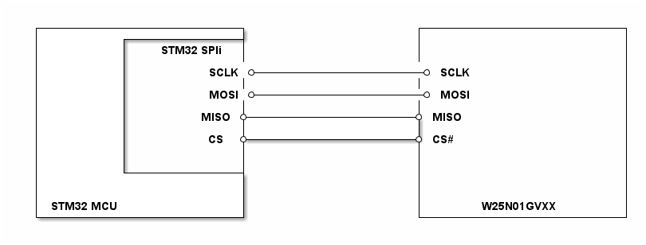

# __Example: *filex_nand_rw_file_no_os*__

**Example version:** 2.0.0

This example demonstrates the use of the **FileX** and **LevelX** stacks in *standalone* mode (no OS) on a **SPI NAND** external memory.

The target external memory is a **Winbond W25N01GVxx** (SPI NAND). The project initializes the memory through the part driver, then FileX:

- opens the `MEDIA_0` media; if opening fails, the media is **formatted** and then re-opened
- creates the `STM32.TXT` file
- writes a test string, closes the file and flushes the media
- re-opens the file for reading, reads it back and checks the content

Execution is considered **OK** when the status LED remains ON. On error, the LED blinks (50 ms ON / 2 s OFF) and the `ExecStatus` variable is set to `EXEC_STATUS_ERROR`.

## __1. Detailed scenario__

__Initialization phase__: At startup, `mx_system_init()` initializes clock, SysTick and peripherals (SPI/GPIO, etc.).

Then the application performs the following steps:

- __Step 1__: initialize FileX (`fx_system_initialize`) and attempt to open the media.
- __Step 2__: if the media is not formatted, **format as FAT** and re-open it.
- __Step 3__: create the `STM32.TXT` file.
- __Step 4__: write data.
- __Step 5__: close + `fx_media_flush`, then re-open and read/validate.
- __Step 6__: close the media.

__End of example__: The example ends by leaving the status LED ON when everything completed successfully. In case of error, the LED blinks (50 ms ON / 2 s OFF) and `ExecStatus` is set to `EXEC_STATUS_ERROR`.

## __2. Example configuration__

### __2.1. NAND memory (W25N01GVxx)__

- The default LevelX driver is **polling** mode.
- The FileX "sector" size is aligned on the NAND **page size** (`W25N01GVXX_DATA_PAGE_SIZE`, typically 2048 bytes). This enables building a FAT filesystem on top of LevelX.

### __2.2. SPI__

The example uses **SPI1** as controller, mode 0 (CPOL=0, CPHA=1st edge), 8-bit, MSB first.

## __3. Hardware environment and setup__

### __3.1. Generic Setup__

This section describes the hardware setup principles that apply to any board.

<!--
@startuml
@startditaa{doc/w25n01gvxx_generic_hardware_setup.png}
  +-------------------------+                     +-------------------------+
  |          +--------------+                     |                         |
  |          |   STM32 SPIi |                     |                         |
  |          |              |                     |                         |
  |          |          SCLK *---------------------* SCLK                   |
  |          |              |                     |                         |
  |          |          MOSI *---------------------* MOSI                   |
  |          |              |                     |                         |
  |          |         MISO *---------------------* MISO                    |
  |          |              |                     |                         |
  |          |          CS  *---------------------* CS#                     |
  |          |              |                     |                         |
  |          |              |                     |                         |
  |          +--------------+                     |                         |
  |                         |                     |                         |
  |                         |                     |                         |
  | STM32 MCU               |                     |       W25N01GVXX        |
  +-------------------------+                     +-------------------------+
@endditaa
@enduml
-->

### __3.2. Specific board setups__

This section describes the exact hardware configuration of your project.

On STM32C5 series.

  
On board NUCLEO-C562RE.

  With the current generated configuration:

  | MCU pin | Signal name | Notes |
  | :---: | :---: | :--- |
  | PA5 | SPI1_SCK | SCK |
  | PA6 | SPI1_MISO | MISO |
  | PA7 | SPI1_MOSI | MOSI |
  | PC9 | CS# | alias `NETR16_2` |

## __4. Troubleshooting__

## __5. See Also__

The documentation of the drivers of the relevant STM32 series contains more detailed information.

## __6. License__

Copyright (c) 2026 STMicroelectronics.

This software is licensed under terms that can be found in the LICENSE file in the root directory
of this software component.
If no LICENSE file comes with this software, it is provided AS-IS.
