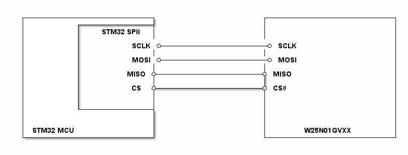

# __Example: *levelx_nand_rw_data_no_os*__

**Example version:** 2.0.0

[](https://dev.st.com/stm32cube-docs/examples/arch-v1/en/index.html "An offline version is also available in the STM32Cube firmware package.")

How to use the LevelX stack in standalone mode.

This application demonstrates read and write operations on NAND flash using the nand flash dma no os driver.


## __1. Detailed scenario__

__Initialization phase__: At main program start, the `mx_system_init()` function is called. It initializes the peripherals, nonvolatile memory (such as flash memory, NVM, or external memories), MPU regions (if applicable), the system clock, and the SysTick.

The application executes the following __example steps__:

- __Step 1__: Initialize, format and open the NAND flash driver.
- __Step 2__: Write data to the test sector.
- __Step 3__: Read data from the test sector.
- __Step 4__: Verify data integrity.
- __Step 5__: Release the test sector.
- __Step 6__: Close the NAND flash driver.
__End of example__: After Step 6, the example is completed.


If you enable `USE_TRACE`, you can follow these execution steps in the terminal logs:

```text
[INFO] Step1: Initializing LevelX NAND flash...
[INFO] LevelX NAND flash initialized successfully
[INFO] Formatting LevelX NAND flash...
[INFO] LevelX NAND flash formatted successfully
[INFO] Opening NAND flash driver...
[INFO] NAND flash driver opened successfully
[INFO] Step2: Writing data to the test sector
[INFO] Successfully wrote data to the test sector
[INFO] Step3: Reading data from the test sector
[INFO] Successfully read data from the test sector
[INFO] Step4: Verifying data integrity...
[INFO] Data integrity check passed
[INFO] Step5: Releasing the test sector...
[INFO] Successfully released the test sector
[INFO] Step6: NAND flash driver closed successfully

```


## __2. Example configuration__

[](https://dev.st.com/stm32cube-docs/examples/arch-v1/en/configure/config_toc.html "An offline version is also available in the STM32Cube firmware package.")

- *NAND*: Configured with the following features and settings:
  - Write, read, and erase operations enabled
  - Optimized for concurrent access
  - Configured for high-speed operations
  - Selected GPIO pins support the NAND alternate function. They are configured in push-pull mode with no pull-up or pull-down.


## __3. Hardware environment and setup__

### __3.1. Generic Setup__

This section describes the hardware setup principles that apply to any board.

<!--
@startuml
@startditaa{doc/w25n01gvxx_generic_hardware_setup.png}
  +-------------------------+                     +-------------------------+
  |          +--------------+                     |                         |
  |          |   STM32 SPIi |                     |                         |
  |          |              |                     |                         |
  |          |          SCLK *---------------------* SCLK                   |
  |          |              |                     |                         |
  |          |          MOSI *---------------------* MOSI                   |
  |          |              |                     |                         |
  |          |         MISO *---------------------* MISO                    |
  |          |              |                     |                         |
  |          |          CS  *---------------------* CS#                     |
  |          |              |                     |                         |
  |          |              |                     |                         |
  |          +--------------+                     |                         |
  |                         |                     |                         |
  |                         |                     |                         |
  | STM32 MCU               |                     |       W25N01GVXX        |
  +-------------------------+                     +-------------------------+
@endditaa
@enduml
-->



### __3.2. Specific board setups__

This section describes the exact hardware configurations of your project.

<details>
<summary>On STM32C5 series.</summary>
<details>
  <summary>On board NUCLEO-C562RE.</summary>

  | Arduino pin | MCU pin | Signal name     | User Label    |
  | :---:       | :---:   | :---:           | :---:         |
  | D13         | PA5     | SPI1_CLK        | -             |
  | D12         | PA6     | SPI1_MISO       | -             |
  | D11         | PA7     | SPI1_MOSI       | -             |
  | D10         | PC9     | SPI1_CS         | -             |

  The W25N01GVXX NAND Flash supports up to 104Mhz. For this example, the SPI1 clock is set to 48Mhz.

</details>
</details>

## __4. Troubleshooting__

[](https://dev.st.com/stm32cube-docs/examples/arch-v1/en/debug/debug_toc.html "An offline version is also available in the STM32Cube firmware package.")


## __5. See Also__

[](https://dev.st.com/stm32cube-docs/examples/arch-v1/en/more/more_toc.html "An offline version is also available in the STM32Cube firmware package.")


## __6. License__

Copyright (c) 2026 STMicroelectronics.

This software is licensed under terms that can be found in the LICENSE file in the root directory
of this software component.
If no LICENSE file comes with this software, it is provided AS-IS.
