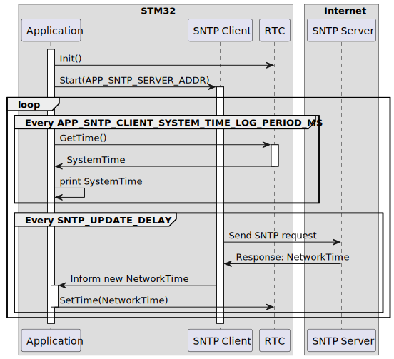
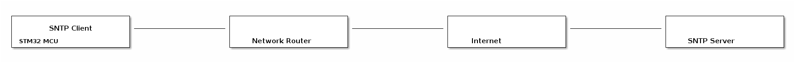

# __Example: *lwip_sntp_client_freertos*__

**Example version:** 2.0.0

How to run an SNTP client application using the LwIP stack and FreeRTOS.  
The SNTP client synchronizes the system time using RTC by querying an SNTP server over the network.

## __1. Detailed scenario__

__Initialization phase__: At main program start, the `mx_system_init()` function is called. It initializes the peripherals, nonvolatile memory (such as flash memory, NVM, or external memories), MPU regions (if applicable), the system clock, and the SysTick.

The application executes the following __example steps__:

__Step 1__: Initializes the application by creating the example task.

__Step 2__: Starts the FreeRTOS scheduler.

__Step 3__: Initializes the LwIP stack.  
__Step 3.1__: Initializes the LwIP stack.  
__Step 3.2__: Initializes and registers network interface.  
__Step 3.3__: Acquires IP address.  

__Step 4__: Starts the SNTP client.  
__Step 4.1__: Initializes the RTC instance.
__Step 4.2__: Configure and start the SNTP client.  
__Step 4.3__: Get and display the RTC Date and Time.  
__Step 4.4__: Convert, display and store to RTC the network time received.  
__Step 4.5__: Stops the SNTP client when no longer needed.  

__End of example__: The SNTP client periodically synchronizes the system time with the configured SNTP server.

__Step 4 is detailed with the following sequence diagram:__

<!--
@startuml{doc/sntp_sequence_diagram_plantUML.svg}

box STM32
participant "Application" as App
participant "SNTP Client" as Client
participant "RTC" as RTC
end box

box Internet
participant "SNTP Server" as Server
end box

activate App

App -> RTC: Init()

App -> Client++: Start(APP_SNTP_SERVER_ADDR)

loop 
group Every APP_SNTP_CLIENT_SYSTEM_TIME_LOG_PERIOD_MS
    App -> RTC++: GetTime()
    App <- RTC--: SystemTime
    App -> App: print SystemTime
end 

group Every SNTP_UPDATE_DELAY

    Client -> Server: Send SNTP request
    Server -> Client: Response: NetworkTime
    Client -> App++: Inform new NetworkTime
    App -> RTC: SetTime(NetworkTime)
    deactivate App
end
end
@enduml
-->

## __2. Example configuration__

### __2.1 Network Setup__

#### Network Configuration

- Ensure your network allows direct TCP connections (no restrictive firewall or proxy).
- For LAN setups, connect all devices to the same network segment.
- For internet setups, ensure the STM32 board can reach the remote server address and port.

#### DHCP Configuration

- The example uses DHCP by default to obtain an IP address. Ensure a DHCP server is available on your LAN.
- If DHCP is not available, the board will fall back to manual configuration after a timeout (see `APP_LWIP_DHCP_TIMEOUT_MS` in `application/app_config.h`).
- Manual IP, netmask, and gateway can be set via `APP_LWIP_MANUAL_IP_ADDR`, `APP_LWIP_MANUAL_NETMASK`, and `APP_LWIP_MANUAL_GW_ADDR` in `application/app_config.h`.
- LwIP middleware must have DHCP enabled (`LWIP_DHCP=1`). If you disable DHCP, remove related code and set a static IP for the LwIP Netif.

#### mDNS Configuration

- The board can announce its hostname on the LAN using mDNS. The default hostname can be set with `APP_LWIP_MDNS_HOSTNAME` in `application/app_config.h`.
- If mDNS fails, use the board's IP address (printed on the STLINK COM port) for remote clients.
- LwIP middleware must have the mDNS responder enabled (`LWIP_MDNS_RESPONDER=1`). If you disable mDNS, remove related code.

### __2.2 Application Setup__

<!--
@startuml
@startditaa{doc/ASCII_ditaa_network_setup.png}
    +-------------------------+                     +-------------------------+                     +-------------------------+                     +-------------------------+
    |                         |                     |                         |                     |                         |                     |                         |
    |       SNTP Client       |---------------------|                         |---------------------|                         |---------------------|                         |
    |                         |                     |                         |                     |                         |                     |                         |
    | STM32 MCU               |                     |    Network Router       |                     |    Internet             |                     |    SNTP Server          |
    +-------------------------+                     +-------------------------+                     +-------------------------+                     +-------------------------+
@endditaa
@enduml
-->

To customize the SNTP client, the user can modify in *application/app_config.h* file:

 - `APP_SNTP_SERVER_ADDR`: which contains the IP address or the domain of the SNTP server the client will query. Example `"pool.ntp.org"`, `"time.google.com"`  
 - `APP_SNTP_CLIENT_SYSTEM_TIME_LOG_PERIOD_MS`: which contains the period in milliseconds the application will display the local time.  

## __3. Hardware environment and setup__

### __3.1. Generic Setup__

### __3.2. Specific board setups__

FreeRTOS exclusively uses the SysTick as its timebase. Thus, `TIM6` is used as a separate timebase for the HAL.

## __4. Troubleshooting__

## __5. See Also__

## __6. License__

Copyright (c) 2026 STMicroelectronics.

This software is licensed under terms that can be found in the LICENSE file in the root directory  
of this software component.  
If no LICENSE file comes with this software, it is provided AS-IS.
