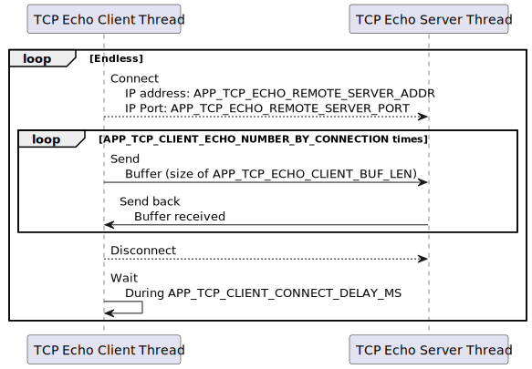
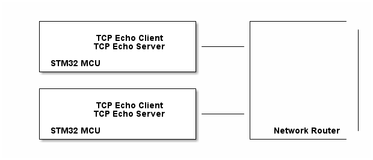
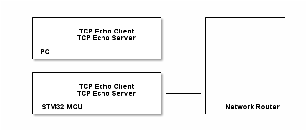
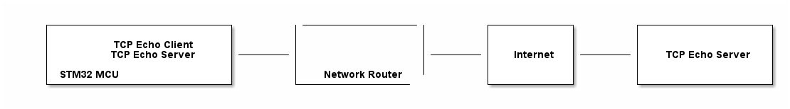

# __Example: *lwip_tcp_echo_freertos*__

**Example version:** 2.0.0

[](https://dev.st.com/stm32cube-docs/examples/arch-v1/en/index.html "An offline version is also available in the STM32Cube firmware package.")

How to run a TCP echo server and client application using socket API.  
The server listens for incoming connections on a specified port, and echoes back any received data.  
The client connects to a server, sends data, and listens for the echoed response.


## __1. Detailed scenario__

__Initialization phase__: At main program start, the `mx_system_init()` function is called. It initializes the peripherals, nonvolatile memory (such as flash memory, NVM, or external memories), MPU regions (if applicable), the system clock, and the SysTick.

The application executes the following __example steps__:

__Step 1__: Initializes the application by creating the example task.

__Step 2__: Starts the FreeRTOS scheduler.

__Step 3__: Initializes the LwIP stack.  
__Step 3.1__: Initializes the LwIP stack.  
__Step 3.2__: Initializes and registers network interface.  
__Step 3.3__: Acquires IP address.  

__Step 4__: Starts the TCP echo server.  
__Step 4.1__: Creates and starts the TCP echo server thread.  
__Step 4.2__: Sets up a TCP socket and wait for incoming connection.  
__Step 4.3__: Processes incoming connection by getting the received data and sending them back to the client.  
__Step 4.4__: Closes the socket.  

__Step 5__: Starts the TCP echo client.  
__Step 5.1__: Creates and starts the TCP echo client thread.  
__Step 5.2__: Sets up a TCP socket and connect to the server.  
__Step 5.3__: Sends the data to the TCP echo server.  
__Step 5.4__: Receives the data from the TCP echo server.  
__Step 5.5__: Closes the socket.  

__End of example__: This example is repeated endlessly (steps 4 and 5 are executed in a loop).

__Steps 4 and 5 are detailed with the following sequence diagram:__

<!--
@startuml{doc/echo_sequence_diagram_plantUML.svg}

participant "TCP Echo Client Thread" as Client
participant "TCP Echo Server Thread" as Server

loop Endless

    Client --> Server: Connect\n    Address: APP_TCP_ECHO_REMOTE_SERVER_ADDR\n    Port: APP_TCP_ECHO_REMOTE_SERVER_PORT
    loop APP_TCP_CLIENT_ECHO_NUMBER_BY_CONNECTION times
        Client -> Server: Send\n    Buffer (size of APP_TCP_ECHO_CLIENT_BUF_LEN)
        Server -> Client: Send back\n    Buffer received
    end
    Client --> Server: Disconnect

    Client -> Client: Wait\n    During APP_TCP_CLIENT_CONNECT_DELAY_MS
end
@enduml
-->




## __2. Example configuration__

[](https://dev.st.com/stm32cube-docs/examples/arch-v1/en/configure/config_toc.html "An offline version is also available in the STM32Cube firmware package.")

This section describes how to configure the example for different network environments and use cases. Follow the steps below to set up your board and network for TCP echo communication.

### __2.1 Network Setup__

#### Network Configuration

- Ensure your network allows direct TCP connections (no restrictive firewall or proxy).
- For LAN setups, connect all devices to the same network segment.
- For internet setups, ensure the STM32 board can reach the remote server address and port.

#### DHCP Configuration

- The example uses DHCP by default to obtain an IP address. Ensure a DHCP server is available on your LAN.
- If DHCP is not available, the board will fall back to manual configuration after a timeout (see `APP_LWIP_DHCP_TIMEOUT_MS` in `application/app_config.h`).
- Manual IP, netmask, and gateway can be set via `APP_LWIP_MANUAL_IP_ADDR`, `APP_LWIP_MANUAL_NETMASK`, and `APP_LWIP_MANUAL_GW_ADDR` in `application/app_config.h`.
- LwIP middleware must have DHCP enabled (`LWIP_DHCP=1`). If you disable DHCP, remove related code and set a static IP for the LwIP Netif.

#### mDNS Configuration

- The board can announce its hostname on the LAN using mDNS. The default hostname can be set with `APP_LWIP_MDNS_HOSTNAME` in `application/app_config.h`.
- If mDNS fails, use the board's IP address (printed on the STLINK COM port) for remote clients.
- LwIP middleware must have the mDNS responder enabled (`LWIP_MDNS_RESPONDER=1`). If you disable mDNS, remove related code.

### __2.2 Application Setup__

- **Two STM32 MCUs running the example:**

    <!--
    @startuml
    @startditaa{doc/ASCII_ditaa_network_setup1.png}
        +-------------------------+        +---------------- +
        |                         |        |                 |
        |       TCP Echo Client   |        |                 |
        |       TCP Echo Server   |--------|                 |
        |                         |        |                 |
        | STM32 MCU 1             |        |                 |
        +-------------------------+        |                 |
                                           |                 |
        +-------------------------+        |                 |
        |                         |        |                 |
        |       TCP Echo Client   |        |                 |
        |       TCP Echo Server   |--------|                 |
        |                         |        |                 |
        | STM32 MCU 2             |        |  Network Router |
        +-------------------------+        +---------------- +
    @endditaa
    @enduml
    -->
    

    On the first STM32 MCU:
    - Set `APP_LWIP_MDNS_HOSTNAME` to `stm32_host_custom_1`.
    - Set `APP_TCP_ECHO_REMOTE_SERVER_ADDR` to `stm32_host_custom_2`.

    On the second STM32 MCU:
    - Set `APP_LWIP_MDNS_HOSTNAME` to `stm32_host_custom_2`.
    - Set `APP_TCP_ECHO_REMOTE_SERVER_ADDR` to `stm32_host_custom_1`.

- **One STM32 MCU and a PC on LAN (PC runs echo server/client):**
    <!--
    @startuml
    @startditaa{doc/ASCII_ditaa_network_setup2.png}
        +-------------------------+        +---------------- +
        |                         |        |                 |
        |       TCP Echo Client   |        |                 |
        |       TCP Echo Server   |--------|                 |
        |                         |        |                 |
        | PC                      |        |                 |
        +-------------------------+        |                 |
                                           |                 |
        +-------------------------+        |                 |
        |                         |        |                 |
        |       TCP Echo Client   |        |                 |
        |       TCP Echo Server   |--------|                 |
        |                         |        |                 |
        | STM32 MCU               |        |  Network Router |
        +-------------------------+        +---------------- +
    @endditaa
    @enduml
    -->
    

        - Running a TCP Echo Server on Linux on port 4242:

            ```sh
            SERVER_PORT=4242
            socat TCP4-LISTEN:$SERVER_PORT,fork EXEC:cat
            ```

        - On the STM32 MCU:
            - Set `APP_LWIP_MDNS_HOSTNAME` to `stm32_host_custom_1`.
            - Set `APP_TCP_ECHO_REMOTE_SERVER_ADDR` to the Linux computer's IP address, for example, `192.168.1.3`.
            - Set `APP_TCP_ECHO_REMOTE_SERVER_PORT` to the Linux computer's TCP echo server port, previously set to `4242`.

        - Running a TCP Echo Client on Linux to send 10 Mbit of random data:

            ```sh
            SERVER_ADDR="stm32_host_custom_1"
            SERVER_PORT=7
            head -c 10M /dev/urandom | nc $SERVER_ADDR $SERVER_PORT -q 1
            ```

- **One STM32 MCU and a remote TCP echo server on the internet:**
    <!--
    @startuml
    @startditaa{doc/ASCII_ditaa_network_setup3.png}
        +-------------------------+        |-----------------|        +-----------+        +------------------+
        |                         |        |                 |        |           |        |                  |
        |       TCP Echo Client   |        |                 |        |           |        |                  |
        |       TCP Echo Server   |--------|                 |--------|  Internet |--------|  TCP Echo Server |
        |                         |        |                 |        |           |        |                  |
        | STM32 MCU               |        |  Network Router |        |           |        |                  |
        +-------------------------+        +---------------- +        +-----------+        +------------------+
    @endditaa
    @enduml
    -->
    

        - On the STM32 MCU:
            - Set `APP_TCP_ECHO_REMOTE_SERVER_ADDR` to the remote server address, for example, `tcpbin.com`.
            - Set `APP_TCP_ECHO_REMOTE_SERVER_PORT` to the remote server's TCP echo port, for example, `4242`.


## __3. Hardware environment and setup__

### __3.1. Generic Setup__

### __3.2. Specific board setups__

FreeRTOS exclusively uses the SysTick as its timebase. Thus, `TIM6` is used as a separate timebase for the HAL.


## __4. Troubleshooting__

[](https://dev.st.com/stm32cube-docs/examples/arch-v1/en/debug/debug_toc.html "An offline version is also available in the STM32Cube firmware package.")


## __5. See Also__

[](https://dev.st.com/stm32cube-docs/examples/arch-v1/en/more/more_toc.html "An offline version is also available in the STM32Cube firmware package.")


## __6. License__

Copyright (c) 2026 STMicroelectronics.

This software is licensed under terms that can be found in the LICENSE file in the root directory
of this software component.
If no LICENSE file comes with this software, it is provided AS-IS.
