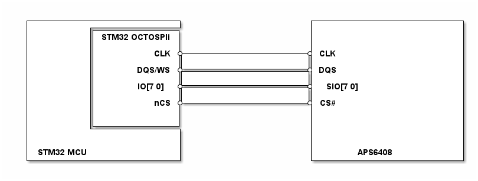

# __Example: *w25n01gvxx_read_write_dma*__

**Example version:** 2.0.0

[](https://dev.st.com/stm32cube-docs/examples/arch-v1/en/index.html "An offline version is also available in the STM32Cube firmware package.")

How to use the W25N01GVXX SPI flash memory using "read/write dma" APIs.
This example illustrates the process of writing and reading data from the SPI flash memory using DMA.


## __1. Detailed scenario__

This scenario demonstrates how to read/write to a W25N01GVXX SPI flash memory with the w25n01gvxx part driver APIs.

__Initialization phase__: At main program start, the `mx_system_init()` function is called. It initializes the peripherals, nonvolatile memory (such as flash memory, NVM, or external memories), MPU regions (if applicable), the system clock, and the SysTick.

The application executes the following __example steps__:

__Step 1__: Initializes the w25n01gvxx part.

__Step 2__: Erases the block in which we want to write

__Step 3__: Writes a data buffer to the flash memory.

__Step 4__: Reads the same data buffer from the external memory, in continuous read mode for multi-page reads and checks that it matches the buffer written in Step 3.

__Step 5__: Deinitializes the W25N01GVXX part.

__End of example__: After step 5, the example is completed. You can verify that the example runs properly via the status LED and the `ExecStatus` variable.

If you enable `USE_TRACE`, you can follow these execution steps in the terminal logs:

```text
[INFO] Step 1: Device initialization COMPLETED.
[INFO] Step 2: Block erased
[INFO] Step 3: Data buffer written to the flash memory.
[INFO] Step 4: Data buffer read in continuous mode from the flash memory and matching the initial value.
[INFO] Step 5: Device de-initialization.
```


## __2. Example configuration__

[](https://dev.st.com/stm32cube-docs/examples/arch-v1/en/configure/config_toc.html "An offline version is also available in the STM32Cube firmware package.")


__W25N01GVXX__: The NOR flash memory is configured with this specific parameter:

- A CS pin configured as output to be selected in the part configuration panel.

__SPI__: The SPI is configured with these specific parameters:

- Mode set to "HAL_SPI_MODE_MASTER"
- Direction set to "HAL_SPI_DIRECTION_FULL_DUPLEX"
- Data width mode set to "HAL_SPI_DATA_WIDTH_8_BIT"
- Clock polarity set to "HAL_SPI_CLOCK_POLARITY_LOW"
- Clock phase set to "HAL_SPI_CLOCK_PHASE_1_EDGE"
- Baudrate prescaler set to "HAL_SPI_BAUDRATE_PRESCALER_256"
- First bit set to "HAL_SPI_MSB_FIRST"
- nss pin management set to "HAL_SPI_NSS_PIN_MGMT_INTERNAL"


## __3. Hardware environment and setup__

### __3.1. Generic Setup__

This section describes the hardware setup principles that apply to any board.

<!--
@startuml
@startditaa{doc/generic_hardware_setup.png}
  +-------------------------+                     +-------------------------+
  |          +--------------+                     |                         |
  |          |   STM32 SPIi |                     |                         |
  |          |              |                     |                         |
  |          |          SCLK *---------------------* SCLK                   |
  |          |              |                     |                         |
  |          |          MOSI *---------------------* MOSI                   |
  |          |              |                     |                         |
  |          |         MISO *---------------------* MISO                    |
  |          |              |                     |                         |
  |          |          CS  *---------------------* CS#                     |
  |          |              |                     |                         |
  |          |              |                     |                         |
  |          +--------------+                     |                         |
  |                         |                     |                         |
  |                         |                     |                         |
  | STM32 MCU               |                     |       W25N01GVXX          |
  +-------------------------+                     +-------------------------+
@endditaa
@enduml
-->



### __3.2. Specific board setups__

This section describes the exact hardware configurations of your project.

<details>
  <summary>On STM32C5 series.</summary>
  <details>
    <summary>On board NUCLEO-C542RC.</summary>

  |  MCU pin  |  Signal name  |  User Label  |
  |:---------:|:-------------:|:------------:|
  |    PH0    |  RCC_OSC_IN   |    OSC_IN    |
  |    PH1    |  RCC_OSC_OUT  |   OSC_OUT    |
  |    PA2    |   USART2_TX   |     PA2      |
  |    PA5    |   SPI1_SCK    |     PA5      |
  |    PA6    |   SPI1_MISO   |     PA6      |
  |    PA7    |   SPI1_MOSI   |     PA7      |
  |    PC9    |     GPIO      |      -       |

  The W25N01GVXX NAND Flash supports up to 104Mhz. For this example, the SPI2 clock is set to 48Mhz.

  </details>

  <details>
    <summary>On board NUCLEO-C562RE.</summary>

  |  MCU pin  |  Signal name  |  User Label  |
  |:---------:|:-------------:|:------------:|
  |    PH0    |  RCC_OSC_IN   |    OSC_IN    |
  |    PH1    |  RCC_OSC_OUT  |   OSC_OUT    |
  |    PA2    |   USART2_TX   |     PA2      |
  |    PA5    |   SPI1_SCK    |     PA5      |
  |    PA6    |   SPI1_MISO   |     PA6      |
  |    PA7    |   SPI1_MOSI   |     PA7      |
  |    PC9    |     GPIO      |      -       |

  The W25N01GVXX NAND Flash supports up to 104Mhz. For this example, the SPI2 clock is set to 48Mhz.

  </details>

  <details>
    <summary>On board NUCLEO-C5A3ZG.</summary>

  |  MCU pin  |  Signal name  |  User Label  |
  |:---------:|:-------------:|:------------:|
  |    PH0    |  RCC_OSC_IN   |  PH0_OSC_IN  |
  |    PH1    |  RCC_OSC_OUT  | PH1_OSC_OUT  |
  |    PA2    |   USART2_TX   | DBGIN_VCP_TX |
  |    PA5    |   SPI1_SCK    |     PA5      |
  |    PA6    |   SPI1_MISO   |     PA6      |
  |    PA7    |   SPI1_MOSI   |     PA7      |
  |    PB5    |     GPIO      |      -       |

  The W25N01GVXX NAND Flash supports up to 104Mhz. For this example, the SPI2 clock is set to 48Mhz.

  </details>
</details>


## __4. Troubleshooting__

[](https://dev.st.com/stm32cube-docs/examples/arch-v1/en/debug/debug_toc.html "An offline version is also available in the STM32Cube firmware package.")


## __5. See Also__

[](https://dev.st.com/stm32cube-docs/examples/arch-v1/en/more/more_toc.html "An offline version is also available in the STM32Cube firmware package.")

The documentation of the drivers of the relevant STM32 series contains more detailed information.

For instance for the STM32C5 series: [HAL documentation](https://dev.st.com/stm32cube-docs/stm32c5xx-hal-drivers/latest/en/index.html).

More information about the STM32 ecosystem can be found in the [STM32 MCU Developer Zone](https://www.st.com/content/st_com/en/stm32-mcu-developer-zone/embedded-software.html).


## __6. License__

Copyright (c) 2026 STMicroelectronics.

This software is licensed under terms that can be found in the LICENSE file in the root directory
of this software component.
If no LICENSE file comes with this software, it is provided AS-IS.
